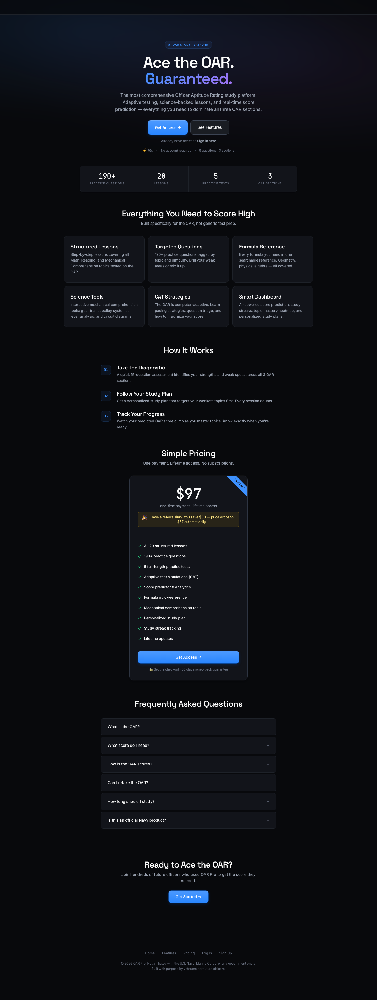
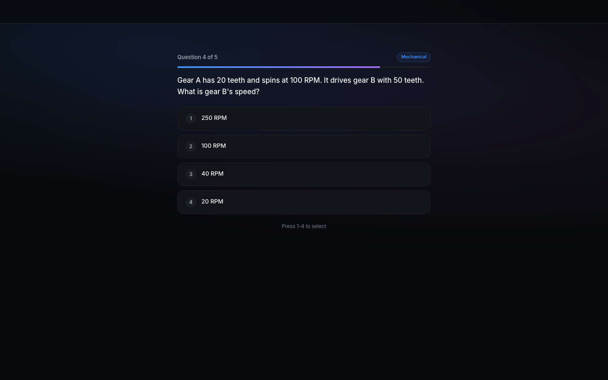

# OAR Pro

A production SaaS for U.S. Navy / Marine Corps officer candidates preparing for the **Officer Aptitude Rating (OAR)** — the math / reading / mechanical-comprehension exam gating pilot and flight-officer selection.

Built as a single-page app in vanilla JavaScript on top of a Supabase Postgres backend with row-level security, a Stripe Edge-Function checkout, and a defense-in-depth security model (trigger-level privilege freezing on top of RLS).



---

## What it does

- **Free 5-question diagnostic** (public, no account) that predicts an OAR score, breaks it out by section, and bands the user against the official passing cutoff.
- **Adaptive CAT simulation** — mirrors the real OAR's computer-adaptive behavior for test-day realism.
- **220+ tagged practice questions** across Math, Reading Comprehension, and Mechanical Comprehension, drillable by topic and difficulty.
- **20 structured lessons** with MathJax-rendered formulas and worked problems.
- **41 parameterized question generators** producing unlimited drill variants.
- **Formula reference** with memory tricks, categorized and searchable.
- **Smart dashboard** with score prediction, study streaks, topic mastery heatmap, and personalized study plans.
- **Affiliate program** with referral codes, earnings tracking, and admin payout views.
- **Admin console** — sales dashboard, affiliate management, content preview.

## Tech stack

| Layer | Choice | Why |
|---|---|---|
| Frontend | Vanilla JS (no framework), hash-based SPA router, ~15 view modules | Zero build step, sub-second cold load, trivially hostable anywhere. |
| Styling | Hand-rolled CSS design system (HSL tokens, layered shadows, custom easing) | References Linear, Raycast, Vercel. Space Grotesk + Inter + JetBrains Mono. Dark, premium, non-templated. |
| Math rendering | MathJax v3 (CHTML) | Proper LaTeX for formulas without the $...$ currency-conflict trap. |
| Backend | Supabase (Postgres + Auth + Edge Functions) | Fastest path to a production-grade auth + RLS stack. |
| Payments | Stripe Checkout via Supabase Edge Function + webhook | Hosted checkout, no PCI scope. Webhook flips `is_paid` via service-role only. |
| Hosting | Vercel (static) + Supabase (DB/functions) | Free tier → scale path. |

## Architecture highlights

### 1. Defense-in-depth security

Content (lessons, questions, formulas, worked problems) is gated three ways:

1. **Frontend route guard** — `router.js` checks `isPaid()` before rendering content routes and redirects non-paid users to the dashboard upgrade prompt.
2. **Row-Level Security (RLS)** — Postgres policies require `profiles.is_paid = TRUE` (or `preview` / `admin` account type) for every SELECT on content tables. The anon key cannot see the content at all; authenticated-but-unpaid users get zero rows.
3. **Column-level privilege freeze** — a `BEFORE UPDATE` trigger on `profiles` (`prevent_profile_privilege_escalation`) silently resets `is_paid`, `account_type`, `stripe_*`, and referral earnings back to their OLD values for any non-service role. This means even a full client-side exploit of RLS can't self-upgrade. Only the Stripe webhook (running as `service_role`, which bypasses RLS) can flip the paid bit.

Bonus: `pending_payments` and the affiliate tables have RLS enabled with **zero policies**, so they're invisible to anon/authenticated roles entirely. Only the webhook reaches them.

See: [`supabase/migrations/007_security_hardening.sql`](supabase/migrations/007_security_hardening.sql) and [`supabase/migrations/002_rls.sql`](supabase/migrations/002_rls.sql).

### 2. Hash router with layered access control

`js/router.js` is a single 200-line file that handles:

- Exact and parameterized routes (`/study/:id`).
- Query-string parsing (affiliate ref capture).
- Public / authenticated / paid / admin tiers as four layers of guard.
- Layout reset between public and app shells (sidebar show/hide, full-width toggle).
- Fade transitions tied to per-route MathJax re-typesetting.
- Tawk.to live-chat context attributes updated per view.

### 3. Adaptive diagnostic

A curated 5-question public diagnostic ([`js/views/diagnostic.js`](js/views/diagnostic.js)) pulls from the live question bank if reachable, with static fallbacks so it always works offline. It predicts a scaled OAR score, confidence range, and assigns the user to a band (minimum-passing → elite) against the real-world cutoffs. The results screen doubles as the primary conversion surface.



### 4. Clean migration history

Ten numbered SQL migrations tell the story of the build:

```
001_schema.sql                        — initial tables
002_rls.sql                           — RLS policies
003_seed_content.sql                  — lessons/questions/formulas seed
004_fix_math_content.sql              — LaTeX content fixes
005_affiliate_referrals.sql           — affiliate program
006_pending_payments.sql              — Stripe webhook idempotency
007_security_hardening.sql            — CRITICAL: privilege-escalation fixes
008_idempotency_and_rpc_security.sql  — RPC lockdown
009_grant_auth_admin_pending_payments.sql
010_fix_latex_double_backslash.sql
```

## Repository layout

```
oar-pro-v4/
├── index.html                    SPA shell + design-system CSS (inline, 39KB)
├── js/
│   ├── supabase-init.js          Supabase client bootstrap + auth helpers
│   ├── router.js                 Hash router with public/paid/admin guards
│   ├── auth.js                   Nav rendering, login/signup/reset flows
│   ├── store.js                  App state (current quiz, progress cache)
│   ├── scorecard.js              Score prediction algorithm
│   ├── checkout.js               Stripe Checkout handoff
│   ├── generators/index.js       41 parameterized question generators
│   └── views/
│       ├── landing.js            Public sales page
│       ├── diagnostic.js         5-Q public diagnostic
│       ├── onboarding.js         Test-date + goal setup
│       ├── dashboard.js          Score prediction, streaks, heatmap
│       ├── study.js              Lesson browser & reader
│       ├── practice.js           Topic drills + infinite mode
│       ├── adaptive.js           Full CAT simulation
│       ├── formulas.js           Searchable formula reference
│       ├── strategies.js         Test-day strategy lessons
│       ├── tutor.js              Guided worked problems
│       ├── profile.js            Account + danger zone
│       └── admin/                sales, affiliates, preview
├── supabase/
│   ├── migrations/               10 numbered SQL migrations
│   └── functions/
│       ├── create-checkout/      Stripe Checkout session creator
│       └── stripe-webhook/       Payment webhook → flip is_paid
└── scripts/                      Content seeding and cleanup utilities
```

## Running locally

Prerequisites: Python 3 (or any static file server), a Supabase project (or the shared demo instance already wired into `supabase-init.js`).

```bash
cd oar-pro-v4
python3 -m http.server 8765
# → http://localhost:8765/
```

The public landing and diagnostic work immediately. To try the full authenticated experience, create an account via the signup form — `is_paid` defaults to `FALSE`, so you'll see the paywalled dashboard. To simulate a paid user for development, mark your profile paid from the Supabase SQL editor:

```sql
update profiles set is_paid = true where email = 'you@example.com';
```

(The trigger blocks this from the client — service-role only, by design.)

## Try it in 60 seconds (the recruiter path)

1. Open `index.html` via a local server (link above).
2. Click **Start Diagnostic** on the landing hero, or navigate to `#/diagnostic`.
3. Answer 5 questions, see your predicted OAR score, section breakdown, and conversion screen.
4. Click around the landing page sections (features, stats, pricing).
5. Hit `?` anywhere in the app for the global keyboard-shortcut overlay.

Screenshots in [`assets/screenshots/`](assets/screenshots/).

## Status

Shipped. Live on Vercel. Real customers. Actively maintained.

— Benjamin Rodriguez
